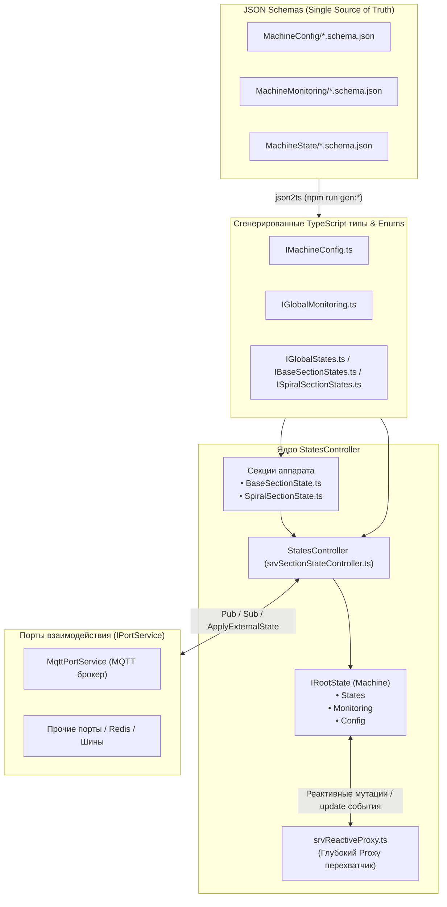

<div style="font-family: 'Open Sans', sans-serif; font-size: 16px">

# Модуль StatesController (Центральный контроллер состояний аппарата)

<div style="color: #555">
<p align="center">
<!--  -->
</p>
</div>

## Лицензия
////

### Описание модуля
Модуль **`StatesController`** является ядром управления состоянием вендингового аппарата. Он реализует концепцию **Single Source of Truth (Единый источник правды)**: агрегирует все операционные состояния компонентов, данные мониторинга наработки и аппаратную конфигурацию в единое реактивное дерево `Machine`.

Ключевые возможности и архитектурные принципы модуля:
1. **Строгая типизация по JSON Schema:** Все структуры данных, интерфейсы и перечисления состояний (`enums`) генерируются автоматически из схем каталога [js/srvStatesController/schema](file:///S:/nikita.umnov/Project-27_2025-N1-SOFT/js/srvStatesController/schema) в каталог [js/srvStatesController/ts](file:///S:/nikita.umnov/Project-27_2025-N1-SOFT/js/srvStatesController/ts).
2. **Реактивность через Deep Proxy:** Любая мутация в дереве `Machine` автоматически перехватывается прокси-оберткой [`srvReactiveProxy`](file:///S:/nikita.umnov/Project-27_2025-N1-SOFT/js/srvStatesController/js/srvReactiveProxy.ts) без необходимости вызывать ручные методы публикации.
3. **Двунаправленная синхронизация с внешними сервисами:** Изменения состояния мгновенно публикуются во внешние брокеры (MQTT и др.) через порты [`IPortService`](file:///S:/nikita.umnov/Project-27_2025-N1-SOFT/js/srvStatesController/js/srvSectionStateController.ts#L37-L42). Входящие внешние команды и обновления применяются к локальному состоянию с защитой от эхо-циклов.
4. **Модульность секций аппарата:** Состояния секций строятся на базе обобщенного класса [`BaseSectionState`](file:///S:/nikita.umnov/Project-27_2025-N1-SOFT/js/srvStatesController/js/srvBaseSectionState.ts#L32-L88) и специализируются под конкретную механику (например, [`SpiralSectionState`](file:///S:/nikita.umnov/Project-27_2025-N1-SOFT/js/srvSpiralSection/js/srvSpiralSectionStates.ts#L15-L30) для спирального автомата).

---

### Архитектурная схема



---

### Карта документации модуля

Подробное описание каждой составляющей системы вынесено в специализированные документы:

| Документ | Описание |
| :--- | :--- |
| 📘 [README_SECTION_STATE_CONTROLLER_JS.md](file:///S:/nikita.umnov/Project-27_2025-N1-SOFT/js/srvStatesController/res/README_SECTION_STATE_CONTROLLER_JS.md) | **Контроллер состояний [`StatesController`](file:///S:/nikita.umnov/Project-27_2025-N1-SOFT/js/srvStatesController/js/srvSectionStateController.ts#L66-L373):** устройство класса, дерево `IRootState`, параметры конструктора, методы `ApplyExternalState`, `Reset`, `Destroy`, защита от эхо-циклов и взаимодействие с `IPortService`. |
| 📗 [README_BASE_SECTION_STATE.md](file:///S:/nikita.umnov/Project-27_2025-N1-SOFT/js/srvStatesController/res/README_BASE_SECTION_STATE.md) | **Базовое состояние секции [`BaseSectionState`](file:///S:/nikita.umnov/Project-27_2025-N1-SOFT/js/srvStatesController/js/srvBaseSectionState.ts#L32-L88):** описание модели полок, колонок, матрицы ячеек `Cells`, модулей `IO`, а также специализация для спиральной секции в [`SpiralSectionState`](file:///S:/nikita.umnov/Project-27_2025-N1-SOFT/js/srvSpiralSection/js/srvSpiralSectionStates.ts#L15-L30) (лифт `Lift`, шторка выдачи `DeliveryBox`). |
| 📙 [Работа со схемами.md](file:///S:/nikita.umnov/Project-27_2025-N1-SOFT/js/srvStatesController/res/Работа%20со%20схемами.md) | **Гайд по работе с JSON Schema и кодогенерацией:** регламент обновления схем, скрипты `npm run gen:*` в [package.json](file:///S:/nikita.umnov/Project-27_2025-N1-SOFT/package.json), опции утилиты `json2ts` (`--cwd`, `--enableConstEnums=false`). |
| 📕 [README_REACTIVE_PROXY.md](file:///S:/nikita.umnov/Project-27_2025-N1-SOFT/js/srvStatesController/res/README_REACTIVE_PROXY.md) | **Фабрика реактивного прокси [`createReactiveState`](file:///S:/nikita.umnov/Project-27_2025-N1-SOFT/js/srvStatesController/js/srvReactiveProxy.ts):** механизм глубокого перехвата мутаций (`get`/`set`), кэширование через `WeakMap`, генерация событий `update`. |
| 📒 [README_STATES.md](file:///S:/nikita.umnov/Project-27_2025-N1-SOFT/js/srvStatesController/res/README_STATES.md) | **Справочник состояний:** константы и базовые перечисления аппарата. |

---

### Структура каталогов модуля

```
js/srvStatesController/
├── schema/                 # Исходные JSON-схемы (Single Source of Truth)
│   ├── MachineConfig/      # Схемы аппаратной конфигурации
│   ├── MachineMonitoring/  # Схемы мониторинга и телеметрии
│   └── MachineState/       # Схемы состояний машины и секций
├── ts/                     # Сгенерированные TypeScript контракты и Enum'ы
│   ├── IMachineConfig.ts   # Типы конфигурации
│   ├── IGlobalMonitoring.ts# Типы мониторинга
│   ├── IGlobalStates.ts    # Типы глобальных состояний
│   ├── IBaseSectionStates.ts # Базовые типы секций и ячеек
│   └── ISpiralSectionStates.ts # Типы спиральной секции
├── js/                     # Исходный код реализации
│   ├── srvSectionStateController.ts # Класс StatesController
│   ├── srvBaseSectionState.ts       # Базовый класс секции BaseSectionState
│   ├── srvReactiveProxy.ts          # Реактивный Proxy перехватчик
│   └── ...
└── res/                    # Техническая документация (Markdown)
    ├── README.md                           # Главный обзорный документ (данный файл)
    ├── README_SECTION_STATE_CONTROLLER_JS.md # Документация StatesController
    ├── README_BASE_SECTION_STATE.md        # Документация BaseSectionState
    ├── Работа со схемами.md                # Гайд по трансляции схем
    ├── README_REACTIVE_PROXY.md            # Документация Deep Proxy
    └── README_STATES.md                    # Справочник констант состояний
```

---

### Базовый пример интеграции

```typescript
import StatesController from './srvSectionStateController';
import { SpiralSectionState } from '../../srvSpiralSection/js/srvSpiralSectionStates';
import { MqttPortService } from './srvMQTTPortService';
import { MachineConfig, SECTION_TYPE } from '../ts/IMachineConfig';
import { GLOBAL_MACHINE_STATE, SECTION_STATUS, CELL_ACTION } from '../ts/IGlobalStates';
import { SPIRAL_CELL_STATE, LIFT_STATE, DELIVERY_BOX_STATE } from '../ts/ISpiralSectionStates';

// 1. Аппаратная конфигурация
const config: MachineConfig = {
    Global: { ID: 'VM-01', Model: 'SnackMaster', StartDate: '2026-01-01' },
    Power: {
        Bus: [{ Voltage: 24 }],
        PSU: [{ VoltageIn: 230, VoltageOut: 24 }]
    },
    Sections: [{
        Name: 'Spiral_1',
        ID: 'sec_1',
        Type: SECTION_TYPE.SPIRAL,
        Rows: 6,
        Cols: 10,
        PowerBus: 1,
        IOList: ['IO_Master'],
        Channels: {}
    }]
};

// 2. Инициализация портов связи и секций
const mqttPort = new MqttPortService('mqtt://127.0.0.1:1883', 'states-controller-client');
const spiralSection = new SpiralSectionState(config.Sections[0]);

// 3. Создание контроллера состояний
const controller = new StatesController({
    sections: [spiralSection],
    portServices: [mqttPort]
}, config);

// 4. Реактивная работа с состоянием
// Изменение поля автоматически отправляет топик "Machine/States/Mode" -> "SERVICE" в MQTT
controller.Machine.States.Mode = GLOBAL_MACHINE_STATE.SERVICE;

// Изменение состояния ячейки в секции
controller.Machine.States.Sections[0].Cells[0] = {
    Status: SPIRAL_CELL_STATE.OVERLOAD_I,
    Action: CELL_ACTION.ACTION
};

// Управление специфичными узлами спиральной секции
spiralSection.Lift = LIFT_STATE.OK;
spiralSection.DeliveryBox = DELIVERY_BOX_STATE.CLOSED;
```

</div>